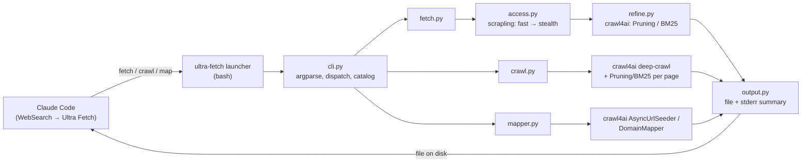
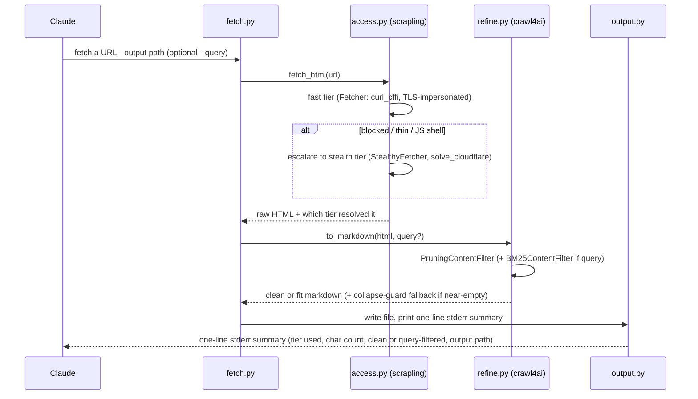
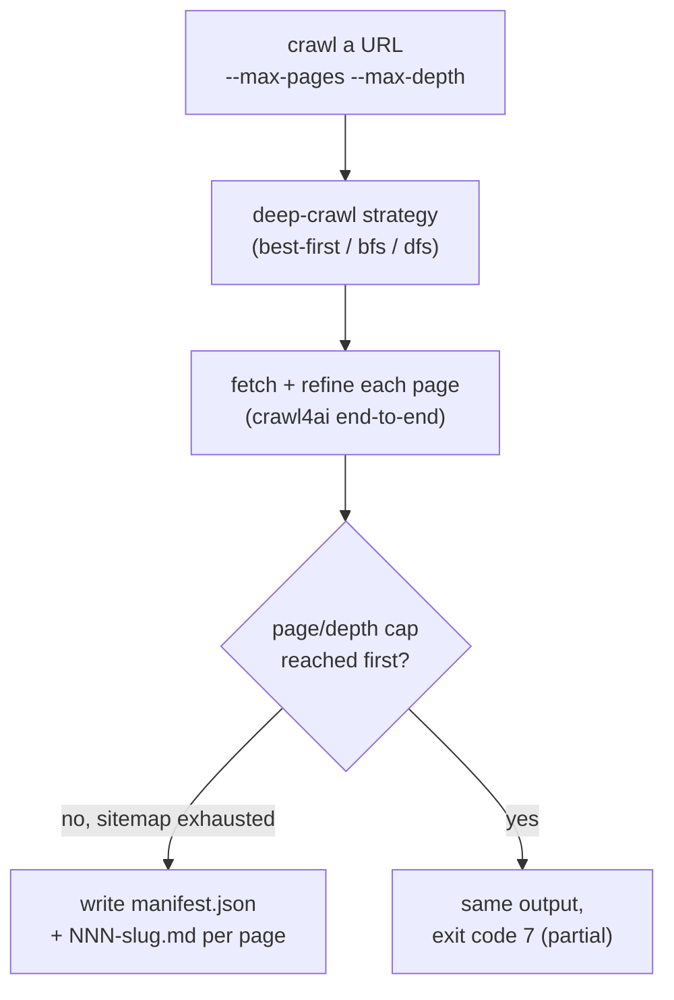
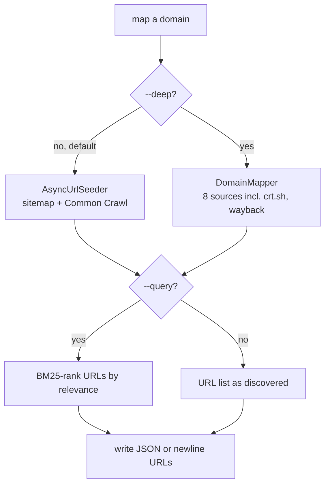

# Architecture

How Ultra Fetch is built: the major pieces, how a command flows through them, and what lives
where in the code. For anyone modifying the CLI or just wanting to trust what it does.

## 1. The two-layer design

Two libraries, deliberately non-overlapping in responsibility:



- **`scrapling` is the access layer** — "can I even reach this page?" Fast static requests that
  escalate to a stealth browser only when needed.
- **`crawl4ai` is the refine + crawl + map layer** — "now make it useful." Its content filters turn
  raw HTML into clean or query-focused markdown; it also owns multi-page traversal and URL
  discovery.

The two compose without a second network request: `crawl4ai`'s filters accept a raw HTML string
directly (`filter_content(html)`), so `access.py` fetches once and hands the bytes straight to
`refine.py`.

## 2. Data flow — `fetch`



## 3. Data flow — `crawl`



Caps are non-negotiable (`--max-pages` defaults to 25, `--max-depth` to 2) — crawl4ai's own
strategies default to unbounded, and depth grows exponentially, so an uncapped default would be a
runaway-fetch risk rather than a convenience. `robots.txt` is ignored by default (`--respect-robots`
opts in); see [Design Decisions §9](Design-Decisions.md#9-why-crawl-is-permissive-by-default-but-capped).

## 4. Data flow — `map`



`map` never fetches a page's content — only what URLs exist, optionally ranked. See
[Concepts §3](Concepts.md#3-crawl-vs-map) for when to reach for this instead of `crawl`.

## 5. Module map

```
.claude/skills/ultra-fetch/
├── SKILL.md                  # the skill Claude reads — judgment, not a flag list
├── scripts/
│   ├── ultra-fetch            # bash launcher: resolves the venv, provisions on first run, execs the CLI
│   ├── requirements.txt       # pinned scrapling[fetchers] + crawl4ai
│   └── ultra_fetch/
│       ├── cli.py             # argparse: subcommands, flags, dispatch, exit codes, `catalog`
│       ├── access.py          # scrapling fetch + tier escalation (fast → stealth)
│       ├── refine.py          # crawl4ai Pruning/BM25 on an HTML string → markdown
│       ├── fetch.py           # the `fetch` command: sequences access → refine → output
│       ├── crawl.py           # the `crawl` command: crawl4ai deep-crawl + manifest
│       ├── mapper.py          # the `map` command: AsyncUrlSeeder / DomainMapper
│       ├── output.py          # file writing, the stderr contract, library log silencing
│       ├── setup.py           # venv provisioning, browser install, upgrade, doctor
│       ├── config.py          # every default and threshold, each with its measured rationale
│       └── errors.py          # exception → exit-code contract
└── tests/                     # pytest for pure logic only — nothing network-touching
```

`cli.py` stays thin by design — argument parsing and dispatch only. Every real judgment (when to
escalate, what to filter, how to cap a crawl) lives in its own concern module, which is what makes
the CLI maintainable as a set of small files rather than one growing script. See the
[Development Guide](Development-Guide.md) for how the dedicated virtualenv and launcher work
together, and to make a change here yourself.

## 6. Design rationale

Every default above — the escalation order, the two-pass Pruning-then-BM25 recipe, the crawl caps,
the file+stderr output shape — was an explicit decision made against a concrete alternative, not
just "the obvious way to do it." The full log, with the reasoning for each: [Design
Decisions](Design-Decisions.md).

---
**Next:** [Concepts](Concepts.md) for the vocabulary used above, or [CLI
Reference](CLI-Reference.md) for the exact flags each command takes. Back to the
[index](README.md).
